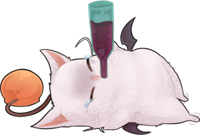

  
  
  <h1>MOGster</h1>  
  

  
   

  
<h2>Features</h2>

- Working on it >.<

<h2>System requirements</h2>

- Final Fantasy 14 (duh?)
- .NET-Framework 4.6
- Advance Combat Tracker (Working on this >.<)
- FFXIV ACT Plugin (I guess we can provide auto download of the latest version)

<h2>Found a bug?</h2>

Check the [Issues](https://github.com/daggeron/Mogster/issues) if the bug has already been reported. If not, submit a [new issue](https://github.com/daggeron/Mogster/issues/new) and provide as many informations as you can.

<h2>License</h2>

This software is published under the [MIT License](https://github.com/daggeron/Mogster/blob/master/LICENSE).

<h2>Setup</h2>
These are raw instructions.
Visual Studio 2019 Community
https://visualstudio.microsoft.com/thank-you-downloading-visual-studio/?sku=Community&rel=16#

Remember, 2019

 
Nodejs LTS
https://nodejs.org/dist/v10.16.0/node-v10.16.0-x64.msi
 
> Also install yarn with NPM
> npm install yarn --global

- Make sure nodejs is installed
- run npm install yarn --global
- Clone repo
- Build mogster.core
- Start cmd line as admin and run mogster.core
- from mogster.ui folder run yarn start
